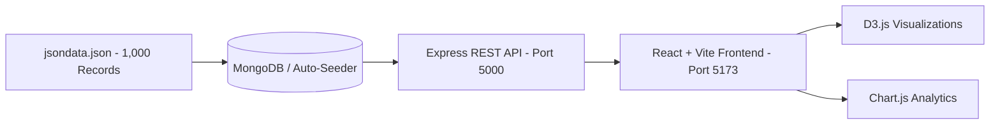

# 📊 InsightPulse - Interactive Data Visualization Dashboard

An enterprise-grade, modern Data Visualization Dashboard built for global trends, macroeconomic indicators, and market intelligence analysis from `jsondata.json`. Styled with **Vuexy-inspired design aesthetics**, featuring rich **D3.js** dynamic physics simulations and **Chart.js** analytics, backed by a **MongoDB** REST API.

---

## 🌟 Key Features

### 1. 🎨 Vuexy-Inspired Design & UI
- **Dark & Light Mode** with persistent theme preferences.
- **Glassmorphism**, refined gradients, smooth transitions, and animated KPI cards.
- **Responsive Layout**: Works across desktop, tablet, and mobile screens.

### 2. 📈 Visualizations & Insights (D3.js & Chart.js)
- **D3.js Dynamic Force Cluster**: Physics-driven interactive bubble simulation of trending topics and insights. Zoom, drag, and click nodes to filter.
- **Temporal Dynamics (Timeline)**: Multi-axis trend analysis comparing Intensity, Likelihood, and Relevance across forecast horizons.
- **Likelihood vs. Relevance Matrix**: Multi-dimensional bubble chart encoding Likelihood (X), Relevance (Y), and Intensity (Radius & Color).
- **Sector Share & Volume**: Donut chart breaking down dominant industrial verticals with percentage shares.
- **PESTLE Macro Matrix**: Radial radar chart analyzing Political, Economic, Social, Technological, Legal, and Environmental drivers.
- **Regional Intensity Ranking**: Horizontal bar chart comparing regional forecast severity.
- **SWOT Strategic Distribution**: Category breakdown of analytical points.
- **Trending Topics Cloud**: Weighted progress bars and tag cloud.

### 3. 🔍 Comprehensive Multi-Dimensional Filters
Filter the entire dashboard instantaneously across 9 dimensions:
1. **End Year** (Dynamic year pills)
2. **Topics** (Searchable multi-select)
3. **Sector** (Searchable multi-select)
4. **Region** (Searchable multi-select)
5. **PESTLE** (Pillars multi-select)
6. **Source** (Publication multi-select)
7. **SWOT** (Strategic factor multi-select)
8. **Country** (Global geographic multi-select)
9. **City** (Location multi-select)
- **Global Search**: Search by keywords across titles, insights, and sources.
- **Quick Presets**: ⚡ Energy Sector, 🇺🇸 United States, 🛢️ Oil & Gas, 💻 Tech & AI.

### 4. 📋 Interactive Data Table & Exporters
- Paginated data table with live column sorting.
- Modal inspection showing complete record attributes and direct source report links.
- **One-click Export to CSV & JSON**.

---

## 🏗️ Architecture & Tech Stack



- **Frontend**: React 18, Vite, D3.js v7, Chart.js, React-Chartjs-2, Lucide Icons, Vanilla CSS Design System
- **Backend**: Node.js, Express.js, Mongoose (MongoDB ORM), Morgan, CORS, Dotenv
- **Database**: MongoDB with automatic seeding and embedded data fallback

---

## 🚀 Quick Start Guide

### Prerequisites
- Node.js (v18+)
- (Optional) Local MongoDB or MongoDB Atlas URI (if not running, the embedded engine handles 1,000 records automatically)

### 1. Start Backend API
```bash
cd backend
npm install
npm start
```
*Backend runs at: `http://localhost:5000`*

### 2. Start Frontend Application
```bash
cd frontend
npm install
npm run dev
```
*Frontend runs at: `http://localhost:5173`*

---

## 📡 REST API Documentation

| Method | Endpoint | Description |
|---|---|---|
| `GET` | `/api/stats` | Aggregate KPIs (Total, Avg Intensity, Likelihood, Relevance, etc.) |
| `GET` | `/api/filters/options` | Unique options with counts for all 9 filter categories |
| `GET` | `/api/data` | Paginated, filtered, sorted raw records (`?page=1&limit=10&sortBy=intensity`) |
| `GET` | `/api/charts/intensity-timeline` | Aggregated metrics by year |
| `GET` | `/api/charts/sector-distribution` | Sector volume and intensity |
| `GET` | `/api/charts/region-analysis` | Regional intensity rankings |
| `GET` | `/api/charts/pestle-matrix` | PESTLE factor scores for radar chart |
| `GET` | `/api/charts/relevance-likelihood`| Correlation points for scatter/bubble plot |
| `GET` | `/api/charts/country-rankings` | Country impact rankings |
| `GET` | `/api/charts/top-topics` | Frequency and intensity scores of top topics |
| `GET` | `/api/charts/swot-distribution` | SWOT category metrics |

### Filter Query Parameters Supported across all Endpoints:
- `end_year`, `topic`, `sector`, `region`, `pestle`, `source`, `swot`, `country`, `city`, `search`

---

## 📝 Assignment Compliance & Submission Checklist

- [x] **Data Source**: Uses authentic 1,000-record `jsondata.json` only.
- [x] **Database**: MongoDB integration via Mongoose + resilient embedded store with auto-seeding.
- [x] **Backend API**: Node.js & Express REST API with full filtering, sorting, pagination, and aggregations.
- [x] **Frontend**: React.js with Tailwind & Vuexy design aesthetics.
- [x] **Visualizations**: D3.js force physics simulation, Chart.js multi-axis timeline, bubble/scatter matrix, sector donut, PESTLE radar, regional bar, SWOT distribution, and topic clouds.
- [x] **All Required Variables Visualized**: Intensity, Likelihood, Relevance, Year, Country, Topics, Region, City.
- [x] **All 9 Required Filters**: End Year, Topics, Sector, Region, PESTLE, Source, SWOT, Country, City, plus keyword search and CSV/JSON exports.
- [x] **Submission Form**: [Google Form Link](https://forms.gle/YBV6Xka5WsrPwYsB8)
